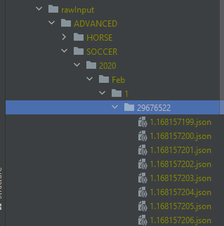
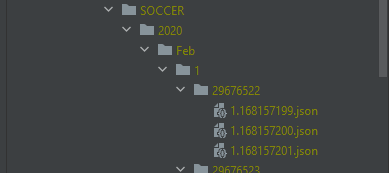

# Errors
- [x] Missing columns, e.g. batl
- [x] Errors loading/dumping NaNs in JSON

# TODO

## IMPORTANT
### PATH
- [ ] set a variable where I can change all times the rawData path, cause isn't always the same -- rawData = "M:\05_BF_DATA\DATA" (string)
- [ ] the same with output folder, please use a variable where I can past everytime the correct output folder (as a string) --- exportOutput rawData = "M:\05_BF_DATA\EXPORT\LAST" (string)
- [ ] create a "exportOutput" folder with date and time in the path so if I run more than one time at day it doesn't override the output Data

if is possible to create a setting file, something like this...
  ```python
  from pathlib import Path


BASE_DIR = Path(__file__).resolve(True).parent.parent


# the path were al files are extract, you have to separate file extracted by sport and by type of data
# Destination DATA files locations
class PathConfig:
    # WORK_DIR = BASE_DIR / "code/rawInput/"
    WORK_DIR = BASE_DIR / "code/rawInput/"

    DATA_ADVANCED_SOCCER = WORK_DIR / 'ADVANCED/SOCCER/'
    DATA_ADVANCED_TENNIS = WORK_DIR / 'ADVANCED/TENNIS/'
    DATA_ADVANCED_HORSE_RACING = WORK_DIR / 'ADVANCED/HORSE RACING/'

    DATA_BASIC_SOCCER = WORK_DIR / "BASIC/SOCCER/"
    DATA_BASIC_TENNIS = WORK_DIR / "BASIC/TENNIS/"
    DATA_BASIC_HORSE_RACING = WORK_DIR / "BASIC/HORSE RACING/"

    # RAW files locations
    RAW_DATA_DIR = BASE_DIR / "rawData"

    RAW_DATA_ADVANCED_SOCCER = RAW_DATA_DIR / 'ADVANCED/SOCCER/'
    RAW_DATA_ADVANCED_TENNIS = RAW_DATA_DIR / 'ADVANCED/TENNIS/'
    RAW_DATA_ADVANCED_HORSE_RACING = RAW_DATA_DIR / 'ADVANCED/HORSE RACING/'

    RAW_DATA_BASIC_SOCCER = RAW_DATA_DIR / 'BASIC/SOCCER/'
    RAW_DATA_BASIC_TENNIS = RAW_DATA_DIR / 'BASIC/TENNIS/'
    RAW_DATA_BASIC_HORSE_RACING = RAW_DATA_DIR / 'BASIC/HORSE RACING/'

    # RAW files locations
    EXPORT_DIR = BASE_DIR / "export"
```


- [ ] I want to add OTHER sport, so if a market is under /ADVANCED/OTHER or /BASIC/OTHER  just set the sport to OTHER and not add any additional info form excel

- [ ] change the props name to this ones
```json
{
  "marketType": "ADVANCED",
  "marketInfo": {},
  "marketRunners": [],
  "marketUpdates": [],
  "marketOdds": [
    {
      "runnerId": 305969,
      "odd": []
    }
  ]
}
       
```

- [ ] It doesn't process all market for soccer, run only over correct score matchOdds and halfTime, missing all Under Over


Input


Output missing market form 202 to 206



### CONSISTENCY
- [ ] uniform time, when you have to do with data or time please convert always in UTC millisecond timestamp (marketInfo.openDate, in marketUpdate.timeStamp and marketUpdate.openDate, and in odds timestamp too  )
- [ ] uniform soccer and football name, use always SOCCER terms
- [ ] fix venue and countyCode where is present ( venue only for HORSE)
- [ ] at the end of the process please empty all temp folder (rawInput)
### RUNNER DB
- [x] for runner DB just save: id, name and sport (not all metadata of the odds)
- [x] in runner DB when add runner please set the sport to, (ex. {"id": 28602170, "name": "Hyde Park Barracks", "sport":"HORSE"}, {"id": 39258079, "name": "Inter AC Milan", "sport":"SOCCER"}, {"id": 56598184, "name": "Novak Djokovic", "sport":"TENNIS"})
- [x] for runner DB files please save with time too (date and time), cause if run the script 2 times a day it will be replaced
- [ ] when save HORSE runners in runnersDB remove the position number if present (ex.     
```json
{
  "id": 27693532,
  "name": "2. Pelonomena",
  "sport": "HORSE RACING"
}, become-->>     
{
  "id": 27693532,
  "name": "Pelonomena",
  "sport": "HORSE RACING"
}, 
```
### FIX
- [x] when check last market update to save the market info, if STATUS == "REMOVED" just skip the market
- [x] in marketUpdate remove "complete" proprieties, I don't need that
      
- [x] change all NaN to null (NaN is not a valid JSON)
- [ ] it doesn't remove some TENNIS market with marketName contains "/" inside (ex. "Bara/Gorgodze v Piter/Sherif" is still present in output)
- [ ] the code already use by code to divide the sport (checkTennis and other functions) remove that and set sport based on where the market is placed in path (the code set HORSE for correct score market because have 16 runners, but is SOCCER )
- [ ] when calculate max and min prematch, if prematch not contain odds set to null
- [ ] please check the calculation, it appears a volume in the prematch when the metadata say that there aren't prematch
### LOG
- [ ] log the time elapsed for every sub task
- [ ] log info about how much market are generate, divided by sport and type (BASIC / ADVANCED)
 
 
