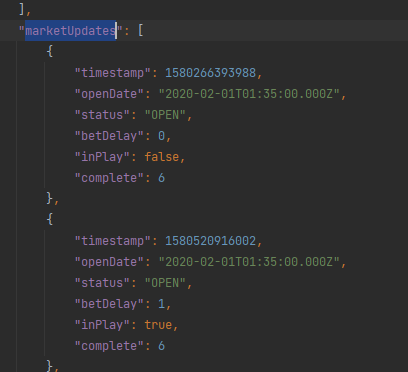
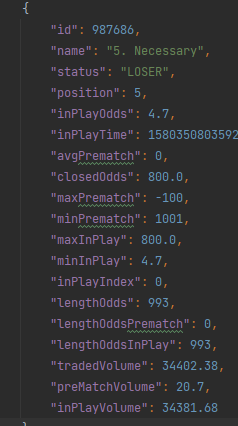
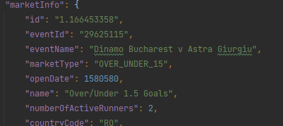
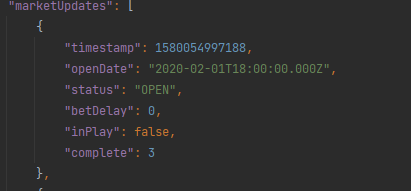

# SUPER IMPORTANT
- [ ] ADDITIONAL INFO DONT WORK FOR TENNIS AND FOR SOCCER TOO
# IMPORTANT
- [ ] Time alwayas as UTC ms unix timestamp, marketUpdates.openDate must be int in UTC
  

- [ ] if "lengthOddsPrematch" == 0 then  "maxPrematch": null , "minPrematch": null

- [ ] if "lengthOddsPrematch" == 0 then volumePrematch = 0, add this volume in volumeInplay
- [ ] openDate (as all time in the code) must be ms UTC, adn must contain hour minute and sec not only date ( WITH ALL THE ZERO, LIKE THIS 1580580000000)


# LAST

- [ ] marketUpdate still have complete props


- [ ] in the final log recap please mark the input and the output to, so I can check how much market are removed or not elaborated

- [ ] when save HORSE runners in runnersDB remove the position number if present (ex.     
```json
{
  "id": 27693532,
  "name": "2. Pelonomena",
  "sport": "HORSE RACING"
}, become-->>     
{
  "id": 27693532,
  "name": "Pelonomena",
  "sport": "HORSE RACING"
}, 
```